# SmartSplit Nepal

**Split less. Settle smarter.**

[](https://github.com/ukr-TA/SmartSplit-Nepal/actions/workflows/ci.yml)


SmartSplit Nepal is a group expense splitting and smart settlement web app. It is built for Nepali college students, friends, roommates, families and travellers. You record shared expenses in rupees, see at a glance who should **give** and who should **receive**, and settle up with the fewest possible payments - by cash, eSewa or Khalti.

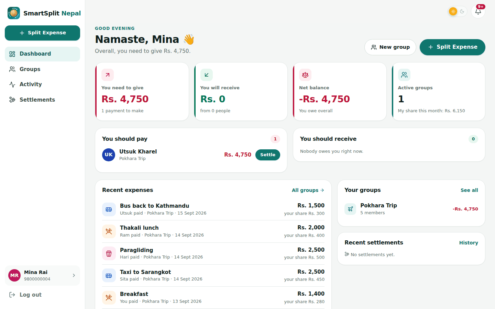

Django REST Framework + React + PostgreSQL · runs on localhost

---

## Highlights

| | |
|---|---|
| **Smart settlement** | A greedy debt-minimisation algorithm (exact matches first) turns every shared expense into at most *n − 1* payments. In the Pokhara demo that is **3 payments instead of 10**. |
| **Three split methods** | Equal, custom amounts and percentages, calculated in exact **paisa** so totals always match. The backend validates everything again. |
| **Quick Split wizard** | Details → Paid by → Split with → How to split → Review. The review screen shows every share and how each person's balance changes, *before* saving. |
| **Payment Hub** | Balance → Settlement → Payment in three clicks. **eSewa** and **Khalti** run as an in-app simulation (works offline) or through the official **test gateways** (eSewa ePay v2 with an HMAC-SHA256 signature, Khalti KPG-2 with a lookup check). Every payment gets a transaction ID and a printable receipt. |
| **Nepal-first** | NPR formatting (`Rs. 1,25,000`), login with a Nepali mobile number, member search by phone number, QR/link invitations, and local categories (rent, utilities…). |
| **Trip Mode** | Trip dates and a trip dashboard: total spent, spending by category, by member (paid vs fair share), and by day. |
| **Machine learning** | Two scikit-learn models trained on a Nepali expense dataset built from published prices and the real festival calendar: a text classifier that suggests the category as you type (97% accuracy, 0.96 macro F1) and a Random Forest that estimates what a group might spend next month, with a one-line reason (for example, Dashain falling on 11–25 October). Both fall back gracefully when the model files are absent. |
| **Transparency** | Receipt photo uploads, an activity timeline, useful notifications, and a full settlement history. |
| **Polished UI** | A clean fintech style with cards, skeleton loaders, empty states, toasts and confirmation dialogs. Light and dark mode. It is responsive, with a bottom navigation bar on phones. |

## Screenshots

| Smart settlement | Quick split review |
|---|---|
| 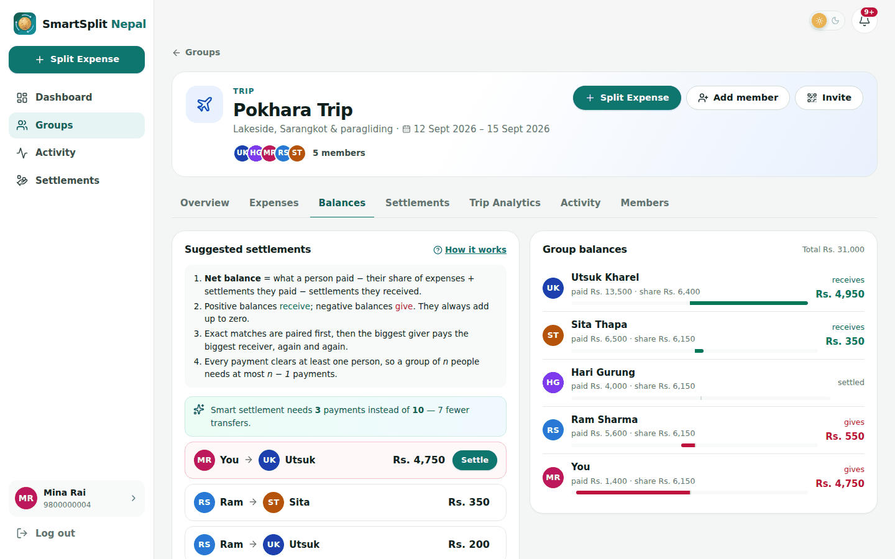 | 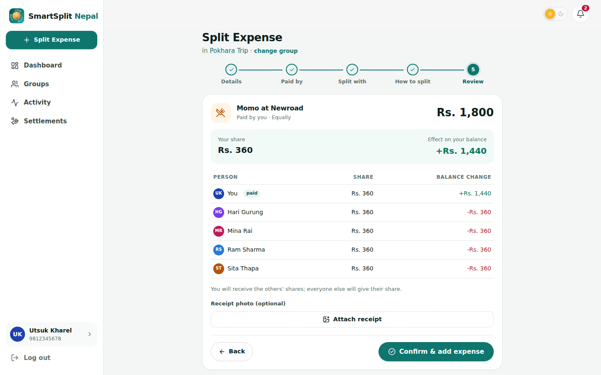 |

| Payment hub | Khalti (demo simulation) | Receipt |
|---|---|---|
| 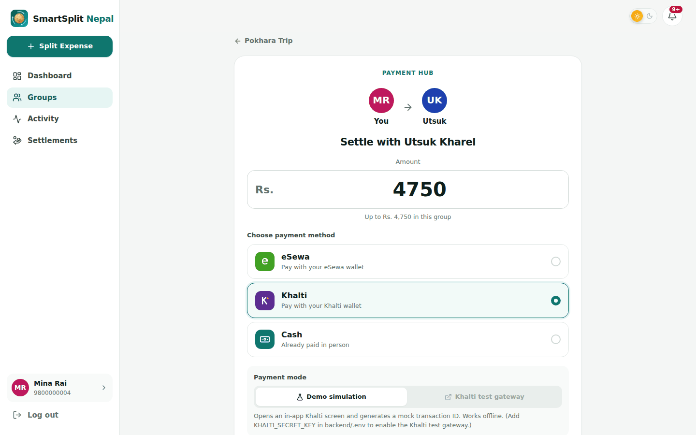 | 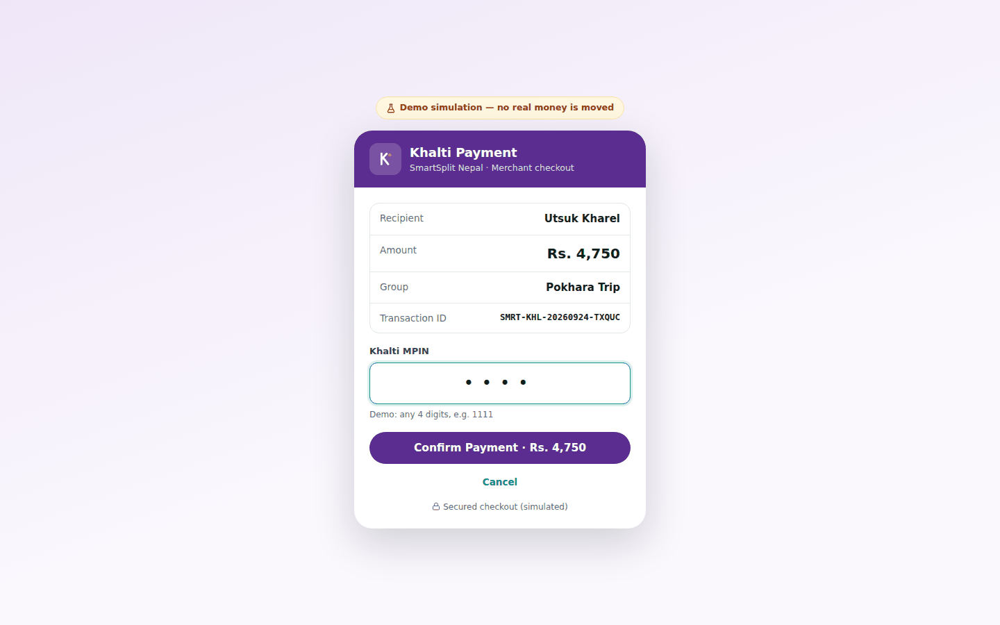 | 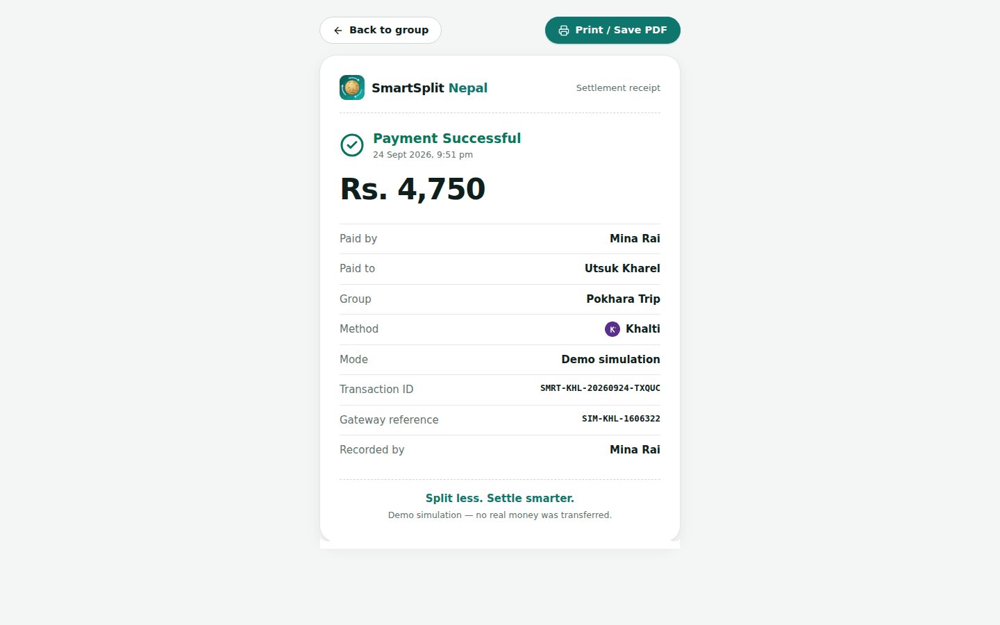 |

| Trip analytics | Expense timeline |
|---|---|
| 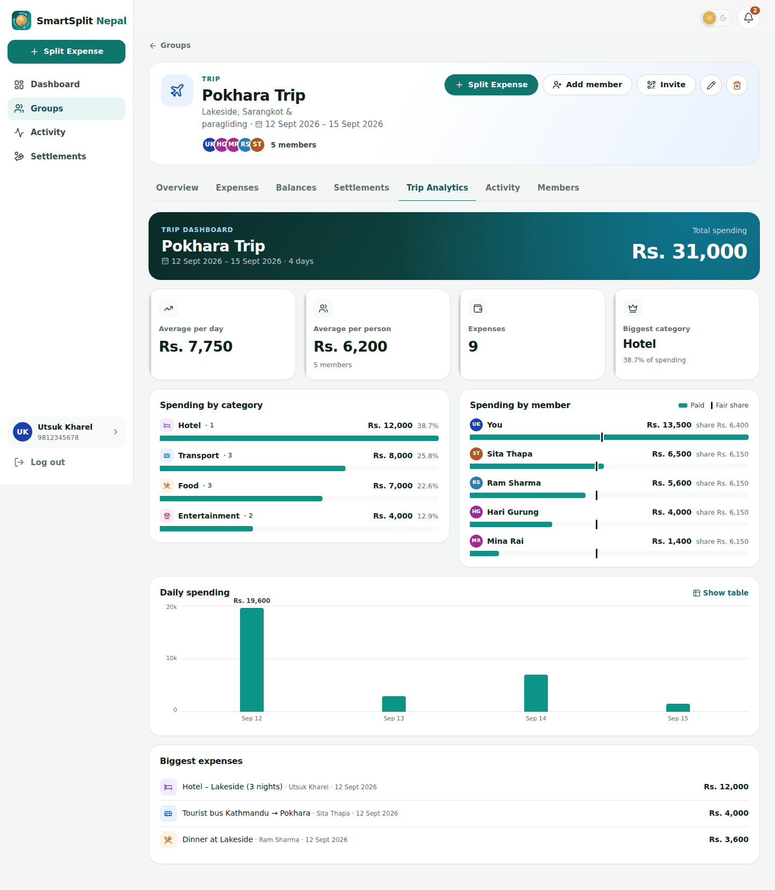 | 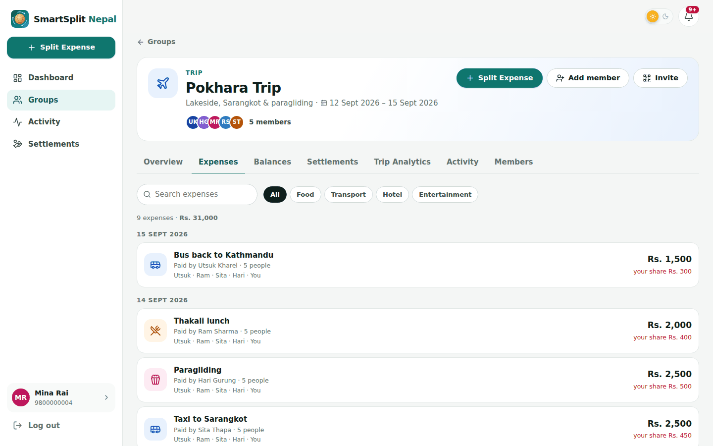 |

| Category suggested by the model | Spending forecast |
|---|---|
| 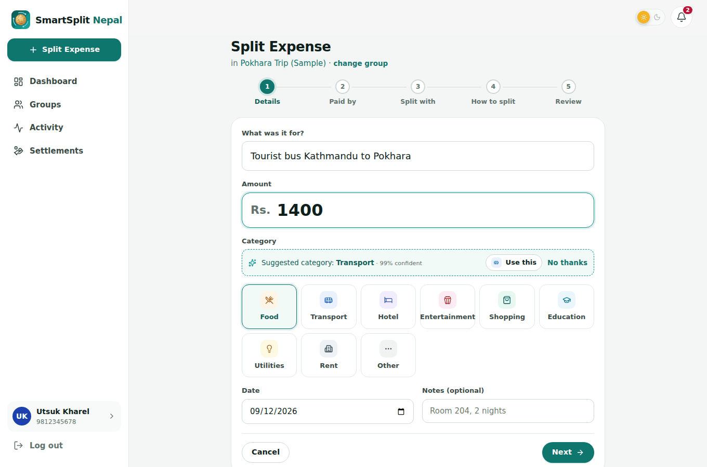 | 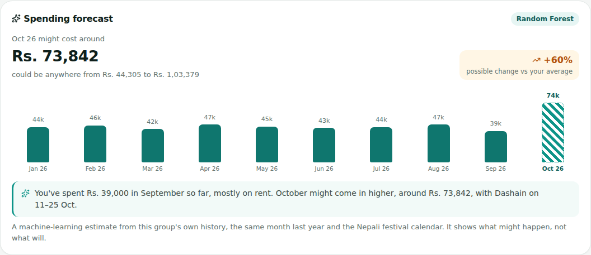 |

| QR invitation | Mobile |
|---|---|
| 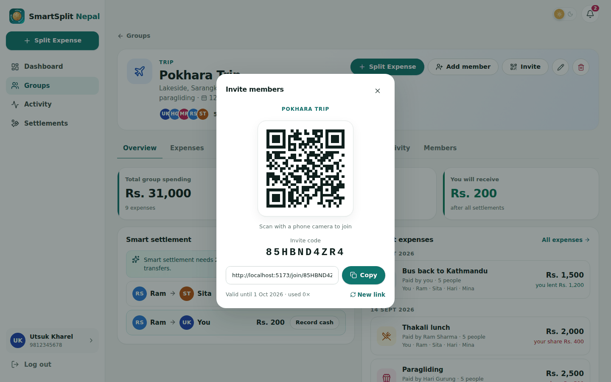 | 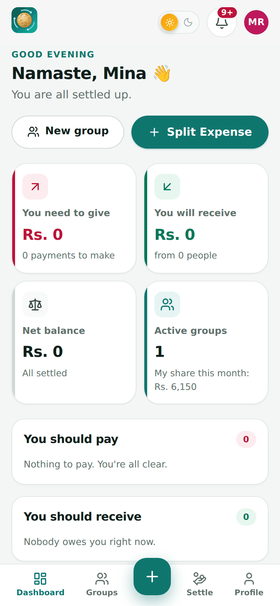 |

## Tech stack

| Layer | Technology |
|-------|------------|
| Backend | Python 3.10+, Django 5.1, Django REST Framework, token authentication |
| Database | PostgreSQL 14+ (psycopg2) |
| Frontend | React 19, Vite 8, React Router 7, Axios, Lucide icons, qrcode.react |
| Payments | eSewa ePay v2 (test environment), Khalti KPG-2 (sandbox), plus an in-app simulation |
| Machine learning | scikit-learn (TF-IDF, Logistic Regression, Random Forest), pandas, Jupyter |
| Quality | 71 Django tests (unit and API), oxlint, GitHub Actions CI, and an end-to-end browser run of the demo |

## Machine learning

Two scikit-learn models, trained in [`ml/notebooks/smartsplit_ml.ipynb`](ml/notebooks/smartsplit_ml.ipynb):

| Model | Task | Held-out result |
|---|---|---|
| TF-IDF + Logistic Regression | Predict an expense category from its description | 97.2% accuracy, 0.96 macro F1 |
| Random Forest | Estimate a group's spending next month, with a one-line reason | MAE Rs. 22,985 vs Rs. 30,691 for the best naive baseline (time-series cross-validation) |

The dataset is synthesised from published Nepali price data (NOC fuel rates, NEA tariff slabs,
Kalimati wholesale prices, telecom and ISP packs, published bus, cinema, hotel and rent figures),
each with its source in [`ml/data/price_reference.csv`](ml/data/price_reference.csv), and follows
the real Nepali festival calendar in [`ml/data/festival_calendar.csv`](ml/data/festival_calendar.csv):
Dashain, Tihar, Teej, Chhath, Holi, Janai Purnima, Krishna Janmashtami, the Lhosars, Eid, the
wedding seasons and more, each on its actual date for every year from 2023 to 2027. It is not
collected from real users, and the documentation says so throughout. The full method,
including how leakage was avoided and which alternative was rejected, is in
[documentation/machine-learning.md](documentation/machine-learning.md).

## How the smart settlement works

1. **Shares.** Each expense is split into per-person shares in integer paisa.
2. **Net balance.** For each person: `paid − share + settlements paid − settlements received`. Positive means **receive**, negative means **give**, and the group total is always 0.
3. **Matching.**
   - Pair any debtor and creditor with *exactly* equal amounts.
   - Then repeatedly have the biggest debtor pay the biggest creditor `min(owes, owed)`.
4. **Why it's efficient.** Every payment clears at least one person, so a group of *n* needs at most *n − 1* payments.

The full worked example is in **[documentation/smart-settlement.md](documentation/smart-settlement.md)**. The code is in [`backend/settlements/algorithm.py`](backend/settlements/algorithm.py) and [`balances.py`](backend/settlements/balances.py).

## Project structure

```text
SmartSplit-Nepal/
├── backend/                 Django project
│   ├── config/              settings (.env), URLs, health check
│   ├── common/              paisa/NPR helpers, test helpers
│   ├── users/               custom user, auth, profile, search, seed_demo command
│   ├── groups/              groups, members, invitations, analytics
│   ├── expenses/            expenses, splits, receipts, split calculator
│   ├── settlements/         balance engine, smart settlement, eSewa/Khalti, dashboard
│   ├── notifications/       activity timeline, notifications
│   ├── requirements.txt
│   └── .env.example
├── frontend/                React (Vite) single-page app
│   └── src/  api · context · hooks · components · pages · utils
├── ml/                      machine learning
│   ├── data/                price_reference.csv, festival_calendar.csv (sourced), expenses.csv, monthly_spending.csv, households.csv
│   ├── notebooks/           smartsplit_ml.ipynb - preprocessing, training, evaluation
│   ├── models/              exported .joblib models and metrics.json
│   ├── festivals.py         the festival year: dates, what each festival makes people buy
│   └── build_dataset.py     deterministic dataset generator
├── documentation/           architecture, database, API, algorithm, ML, testing, demo, Git guide
├── SmartSplit-Nepal-Report.docx   final project report
├── SETUP.md                 complete macOS setup + troubleshooting
└── README.md
```

## Quick start

Full step-by-step instructions (PostgreSQL, `.env`, troubleshooting, reset) are in **[SETUP.md](SETUP.md)**.

```bash
# 1. Database (Postgres.app or Homebrew PostgreSQL running)
psql postgres -c "CREATE USER smartsplit WITH PASSWORD 'smartsplit_pass123' CREATEDB;"
psql postgres -c "CREATE DATABASE smartsplit OWNER smartsplit;"

# 2. Backend - Terminal 1
cd backend
python3 -m venv venv && source venv/bin/activate
pip install -r requirements.txt
cp .env.example .env            # set SECRET_KEY and DATABASE_PASSWORD
python manage.py migrate
python manage.py seed_demo      # optional demo friends (password SmartSplit@123)
python manage.py runserver       # http://127.0.0.1:8000

# 3. Frontend - Terminal 2
cd frontend
npm install
npm run dev                      # http://localhost:5173
```

## Documentation

| Document | Contents |
|----------|----------|
| [SUBMISSION.md](SUBMISSION.md) | What is in the submission ZIP and where each required item lives |
| [SmartSplit-Nepal-Report.docx](SmartSplit-Nepal-Report.docx) | **Final project report** (abstract, design, ML methodology, results, limitations) |
| [SETUP.md](SETUP.md) | Prerequisites, PostgreSQL, backend, frontend, checklist, troubleshooting, reset |
| [documentation/architecture.md](documentation/architecture.md) | System design and key technical decisions |
| [documentation/database.md](documentation/database.md) | Tables, relationships, constraints |
| [documentation/api.md](documentation/api.md) | Every REST endpoint with examples |
| [documentation/machine-learning.md](documentation/machine-learning.md) | Dataset, models, evaluation and how the models are served |
| [documentation/smart-settlement.md](documentation/smart-settlement.md) | Splits → balances → settlement plan, with a worked example |
| [documentation/testing-guide.md](documentation/testing-guide.md) | Click-by-click test plan with expected results |
| [documentation/demo-guide.md](documentation/demo-guide.md) | **How to Demonstrate SmartSplit Nepal** (5–10 minute script) |
| [documentation/git-guide.md](documentation/git-guide.md) | Commit plan, GitHub, screenshots, portfolio wording |

## Testing

```bash
cd backend && source venv/bin/activate
python manage.py test          # 71 tests
cd ../frontend && npm run lint && npm run build
```

## A note on payments

Nothing in this project moves real money.

- **Demo simulation** screens are clearly labelled.
- **Test gateway** mode uses the official eSewa and Khalti *sandbox* environments with test accounts.
- Public merchant APIs pay a business, not a friend. So in SmartSplit the gateway step confirms the payment, and the app then records the settlement between the two members.

## Future enhancements

- Scan receipt photos to fill in expenses automatically (OCR).
- Recurring expenses.
- Reminders by email or push.
- Multiple currencies for trips abroad.
- A mobile app.
- Live wallet payouts through a partnership with a wallet provider.

## License

Released under the [MIT License](LICENSE).

## Author

**Utsuk Kharel**

SmartSplit is inspired by the general shared-expense problem. Its branding, UI, workflow, data model and settlement implementation are original to this project.
